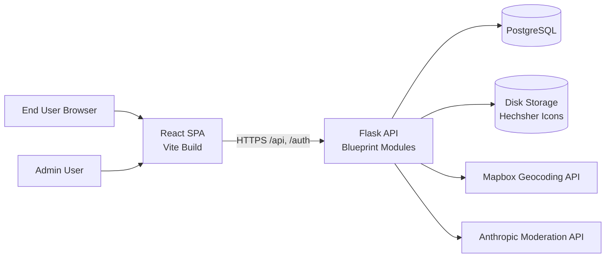
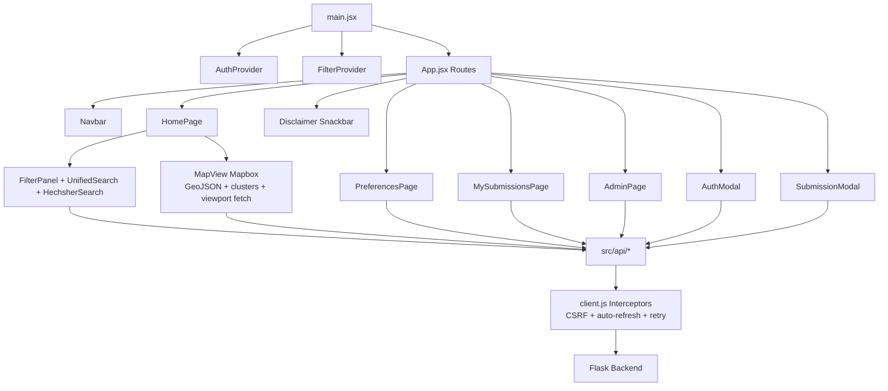
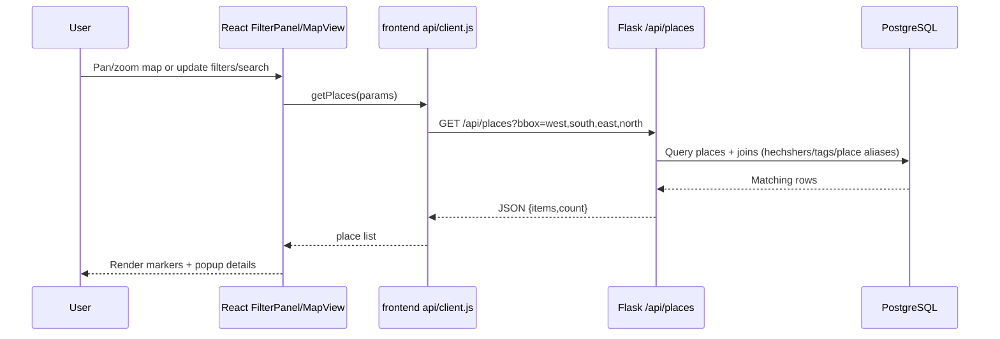
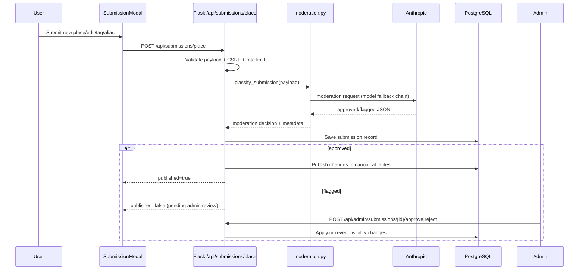

# Mapah Design Document

_Last updated: 2026-06-19_

## 1. Overview

Mapah is a full-stack web application for discovering kosher places, filtering by hechshers and tags, and moderating user-submitted updates.

The system is split into:

- `mapah-frontend`: React + Vite single-page application.
- `mapah-backend`: Flask API with PostgreSQL persistence.
- Third-party integrations: Mapbox Geocoding and Anthropic moderation models.

Core goals:

- Fast location-based discovery UX.
- Safe community submissions through moderation.
- Secure cookie-based authentication and CSRF protection.
- Admin controls for review/approval/rejection workflows.

---

## 2. Detailed Architecture

### 2.1 High-Level Component Architecture



### 2.2 Backend Internal Architecture

```mermaid
flowchart TB
  APP[Flask App Factory\napp/__init__.py]
  APP --> EXT[Extensions\nSQLAlchemy, JWT, Limiter, Migrate]
  APP --> AUTH[/auth blueprint\nauth/views.py]
  APP --> API[/api blueprint\napi/*.py]

  API --> PL[places.py\nplaces + csrf + location search]
  API --> HE[hechshers.py\nsearch + create + icon serving]
  API --> SU[submissions.py\nsubmission pipeline]
  API --> ME[me.py\npreferences + my submissions]
  API --> AD[admin.py\nreview workflow]

  SU --> MOD[services/moderation.py]
  PL --> GEO[services/geocoding.py]
  HE --> MOD

  AUTH --> SEC[utils/security.py]
  API --> SEC
  AUTH --> M[(models.py)]
  API --> M
```

### 2.3 Frontend Internal Architecture



### 2.4 Sequence Diagrams

#### 2.4.1 Fetch and display filtered places



#### 2.4.2 Submission moderation and publish flow



### 2.5 Data Architecture

Primary schema entities (see `mapah-backend/app/models.py`):

- Core data: `places`, `hechshers`, `hechsher_aliases`, `place_hechshers`, `place_tags`, `place_aliases`.
- Identity/security: `users`, `refresh_token_families`, `refresh_tokens`, `revoked_tokens`.
- Moderation workflow: `submissions`.
- User personalization: `user_preferred_hechshers`.

Data principles:

- Keep canonical place data separate from moderation history (`submissions`).
- Preserve audit/history even when rejected or user account deleted.
- Soft-delete places (`is_active=false`) instead of hard deletion on rejection of published new places.

---

## 3. UX Design (Front-End)

### 3.1 UX Goals

- Make discovery map-first and low-friction.
- Keep search and filters discoverable in one side panel.
- Allow quick contribution (add/tag/edit) without leaving main context.
- Keep moderation status transparent to users and admins.

### 3.2 Information Architecture

- Primary nav (`Navbar`): Home, Add Place, Sign in/out, Preferences, My Submissions, Admin (role-based).
- Home route (`/`):
  - Left panel: unified search, hechsher filter, tags, reset action.
  - Main canvas: interactive map with clustered markers and marker popups.
- Global surface:
  - Sticky, dismissible disclaimer snackbar for data-accuracy notice.
- Modal surfaces:
  - `AuthModal` for login/register.
  - `SubmissionModal` for add/edit/tag + inline hechsher creation.
- Route-level pages:
  - `/preferences`: selectable hechsher preferences with autosave feedback.
  - `/my-submissions`: user moderation timeline.
  - `/admin`: admin moderation queue (flagged and non-flagged sections).

### 3.3 Key User Flows

1. Discover places:
   - Search by place or location -> map centers -> markers update.
   - Pan/zoom map and apply hechsher/tags filters -> viewport `bbox` API refetch -> updated results.

2. Contribute data:
   - Open submission modal from navbar or marker popup.
   - Fill address via typeahead or coordinates/geolocation.
   - Select/create hechshers, add tags/aliases.
   - Submit into moderation pipeline.

3. Review moderation outcome:
   - User checks `My Submissions` for status.
   - Admin uses queue to approve/reject pending submissions.

### 3.4 UX Patterns Used

- Progressive disclosure: advanced input options (aliases, inline hechsher creation) shown in context.
- Real-time feedback: debounce search, inline suggestions, optimistic save status in preferences.
- Role-adaptive UI: admin routes and controls exposed only when `user_status === 'admin'`.
- Error clarity: contextual form/API error messages, loading states, fallback responses.

---

## 4. APIs Used

### 4.1 Internal Project API (Flask)

Documented in `mapah-backend/openapi.yaml`.

- Public/data:
  - `GET /api/csrf-token`
  - `GET /api/places`
  - `GET /api/locations/search`
  - `GET /api/hechshers`
  - `GET /api/hechshers/search`
  - `POST /api/submissions/place`
  - `POST /api/places/{id}/tags`
  - `GET /api/places/{id}/aliases`
  - `POST /api/places/{id}/aliases`
  - `POST /api/hechshers`

`GET /api/places` currently supports both legacy proximity params (`radius`, `unit`, `lat/lng`, `location_query`) and viewport filtering via `bbox`; frontend map discovery now uses `bbox` as the primary retrieval mode.

- Authentication/session:
  - `POST /auth/register`
  - `POST /auth/login`
  - `POST /auth/refresh`
  - `POST /auth/logout`
  - `POST /auth/change-password`
  - `DELETE /auth/account`

- User-specific:
  - `GET /api/me/preferences/hechshers`
  - `PUT /api/me/preferences/hechshers`
  - `GET /api/me/submissions`

- Admin moderation:
  - `GET /api/admin/submissions`
  - `GET /api/admin/submissions/{id}`
  - `POST /api/admin/submissions/{id}/approve`
  - `POST /api/admin/submissions/{id}/reject`

### 4.2 External APIs

- Mapbox Geocoding API:
  - Forward geocoding and suggestion lookup via backend (`services/geocoding.py`) and frontend fallback (`src/api/locations.js`).
  - Reverse geocoding in frontend for “Use my location” form assist.

- Anthropic Messages API:
  - Single-call moderation classification in `services/moderation.py`.
  - Returns strict JSON outcome (`approved`/`flagged`) with reason when flagged.

---

## 5. Design Patterns Incorporated

### 5.1 Backend Patterns

- Application Factory Pattern:
  - `create_app()` centralizes app wiring and environment-specific config (`app/__init__.py`).

- Modular Blueprint Pattern:
  - Route groups split by domain and role (`auth`, `api/places`, `api/submissions`, `api/admin`, etc.).

- Decorator-Based Cross-Cutting Concerns:
  - `require_csrf`, `jwt_required_guard`, `admin_required` enforce security uniformly.
  - Limiter decorators enforce submission quotas with success-only deduction.

- Service Layer Pattern:
  - `services/moderation.py` and `services/geocoding.py` isolate external integrations.

- Pipeline/Workflow Pattern (Submissions):
  - Validate -> moderate -> persist submission -> optionally publish.
  - Supports deterministic pre-checks and AI checks in the same flow.

- Fail-safe/Fallback Strategy Pattern:
  - Moderation model fallback chain.
  - Safety defaults to `flagged` on service/config failures.

### 5.2 Frontend Patterns

- Context Provider Pattern:
  - `AuthContext` and `FilterContext` manage cross-page state.

- API Gateway/Client Pattern:
  - Central Axios client with request/response interceptors.
  - Unified CSRF handling + token refresh behavior.

- Container + Presentational Split (lightweight):
  - Route/pages orchestrate state and compose focused components.

- Debounce + Cache Pattern:
  - Unified search debounces remote calls and caches normalized query results.

- Viewport Query Pattern:
  - Map requests places by current visible bounds (`bbox`) on `moveend`.
  - Reduces payload and keeps map results aligned with what is on screen.

- Guarded Route Pattern:
  - `ProtectedRoute` and `AdminRoute` enforce role-based navigation access.

---

## 6. AI/ML Capabilities

### 6.1 Implemented Capabilities

1. AI-assisted moderation classification

- Each submission (place/tag/edit/alias/hechsher create) is classified via Anthropic.
- Output normalized to strict moderation states with metadata:
  - `result`, optional `reason`, `source`, `moderation_version`, and model.

2. Deterministic + AI hybrid moderation

- Rule-based checks run alongside AI to catch high-confidence issues:
  - obvious gibberish/spam text heuristics,
  - inconsistent tag combinations (e.g., `meat` + `dairy`),
  - alias inconsistency checks.
- This hybrid architecture improves reliability and explainability.

3. Safety-first fallback behavior

- Missing or failing moderation services default to `flagged` (except explicit testing bypass mode).
- Prevents unmoderated auto-publish in uncertain conditions.

### 6.2 Future AI/ML Opportunities (Next Iteration)

- Adaptive risk scoring model combining user history, payload similarity, and anomaly signals.
- Duplicate-place detection using embedding similarity over place name/address/aliases.
- Kashrus certificate scanning (OCR + document classification) to extract cert metadata and assist verification workflows.


---

## 7. Deployment Design

### 7.1 Current Deployment Topology

This project is deployed on Render, with backend and frontend running as separate Render services.

- Backend: Render Web Service (`mapah-backend`) from `render.yaml`.
- Database: PostgreSQL (configured via `DATABASE_URL`).
- Persistent storage: Render disk mounted at `/var/data` for hechsher icons.
- Frontend: separate Render Static Site (`mapah-frontend`) serving Vite build output.

### 7.2 Deployment Configuration Highlights

From `render.yaml` and `RENDER_DEPLOY.md`:

- Backend build/start:
  - `pip install -r requirements.txt`
  - `python run.py`
- Health check: `GET /api/csrf-token`
- Runtime/env:
  - Python 3.12.4
  - `FLASK_ENV=production`
  - `HECHSHER_UPLOAD_DIR=/var/data/hechshers`
- Disk:
  - name `mapah-data`, mount `/var/data`, size 1 GB (adjustable)

Frontend static deploy settings (documented):

- Root directory: `mapah-frontend`
- Build: `npm install && npm run build`
- Publish: `dist`
- Required envs include `VITE_MAPBOX_TOKEN` and `VITE_API_BASE_URL`.

### 7.3 Runtime Interaction in Production

```mermaid
flowchart LR
  Browser -->|HTTPS| FrontendStatic[Render Static Site]
  Browser -->|XHR/fetch to VITE_API_BASE_URL| BackendRender[Render Flask Service]
  BackendRender --> PostgreSQL
  BackendRender --> RenderDisk[/var/data/hechshers]
  BackendRender --> Mapbox
  BackendRender --> Anthropic
```

### 7.4 Operational Considerations

- CORS origins must include deployed frontend domain(s).
- JWT and CSRF cookie security flags must match TLS + cross-origin setup.
- Persistent disk is required to retain uploaded icons across redeploys.
- Moderation API key and model config should be validated in pre-production.

---

## 8. Risks and Mitigations

- Third-party API outages (Mapbox/Anthropic):
  - Mitigation: graceful fallbacks, safe moderation default-to-flagged.
- Cross-origin cookie complexity in browsers:
  - Mitigation: CSRF token also persisted in localStorage, strict CORS policy.
- Moderation false positives/negatives:
  - Mitigation: admin review workflow and rejection/rollback support.
- Data quality drift from community edits:
  - Mitigation: submission history, role-based approvals, deterministic checks.

---

## 9. Traceability to Code

- App bootstrap/config: `mapah-backend/app/__init__.py`, `mapah-backend/app/config.py`
- Security utilities: `mapah-backend/app/utils/security.py`
- Auth/session APIs: `mapah-backend/app/auth/views.py`
- Place/filter APIs: `mapah-backend/app/api/places.py`
- Submission pipeline: `mapah-backend/app/api/submissions.py`
- Admin moderation: `mapah-backend/app/api/admin.py`
- Data model: `mapah-backend/app/models.py`
- AI moderation service: `mapah-backend/app/services/moderation.py`
- Geocoding service: `mapah-backend/app/services/geocoding.py`
- Frontend shell/routes: `mapah-frontend/src/App.jsx`
- Frontend disclaimer UI: `mapah-frontend/src/components/Layout/Disclaimer.jsx`
- Frontend map UX: `mapah-frontend/src/components/Map/MapView.jsx`
- Frontend filter UX: `mapah-frontend/src/components/Filters/FilterPanel.jsx`, `mapah-frontend/src/components/Filters/UnifiedSearch.jsx`
- Frontend submission UX: `mapah-frontend/src/components/Submission/SubmissionModal.jsx`
- Frontend API middleware: `mapah-frontend/src/api/client.js`
- Deployment docs/config: `RENDER_DEPLOY.md`, `render.yaml`
